# KV Cache Compression Exploration - Rayaan Ghosh
## Baseline Characterization Report

---

## Table of Contents

1. [Executive Summary](#1-executive-summary)
2. [Experimental Setup](#2-experimental-setup)
3. [KV Cache Memory Growth](#3-kv-cache-memory-growth)
4. [Perplexity Baselines (No Compression)](#4-perplexity-baselines-no-compression)
5. [KV Cache Structure Analysis](#5-kv-cache-structure-analysis)
6. [Llama.cpp KV Quantization Baselines](#6-llamacpp-kv-quantization-baselines)
7. [Conclusions](#7-conclusions)

---

## 1. Executive Summary

This report presents an initial baseline characterization and exploration of key-value (KV) cache behavior and structure in small transformer language models, establishing the ground truth against which future compression methods can be evaluated.

**Key findings:**

- **KV cache memory scales linearly** with context length. At 8K tokens, a TinyLlama-1.1B model requires ≈144 MB for its KV cache in FP16. For longer contexts this becomes the dominant memory consumer.
- **8-bit quantization is nearly lossless.** The llama.cpp Q8_0 KV cache format incurs <0.6% perplexity degradation while delivering a 1.8× decode speedup. 4-bit (Q4_0) degrades perplexity by 20–30%.
- **Value tensors are not delta-compressible.** Across all models and contexts, value delta compressibility is consistently negative or near-zero, meaning adjacent value tokens are decorrelated.
- **Key tensors show moderate delta structure** (30–50% compressibility for TinyLlama, 34–93% for Qwen) with significant variation across layers.
- **SVD energy is highly concentrated.** The top 50% of singular values capture 90–100% of total energy, and the effective rank (90% variance) ranges from 1 to 32 across layers.
- **Qwen exhibits extreme layer-wise heterogeneity.** Layer 0 has an effective rank of *1* and a channel structure ratio exceeding 200× in some layers — strong signals for per-layer adaptive compression.
- **Code is "easier" than prose.** Perplexity on code contexts is 2–5× lower than on prose, implying the KV cache representations are more predictable for structured text.

---

## 2. Experimental Setup

### 2.1 Models

Two transformer language models were characterized, both loaded in FP16 precision via HuggingFace Transformers:


| Model | HuggingFace ID | Layers | KV Heads | Head Dim |
| :--- | :--- | :--- | :--- | :--- |
| TinyLlama | `TinyLlama/TinyLlama-1.1B-Chat-v1.0` | 22 | 4 | 64 |
| Qwen | `Qwen/Qwen2.5-0.5B-Instruct` | 24 | 2 | 64 |


### 2.2 Contexts

Two context types were used throughout:

- **Prose** — a ≈730-token passage on hydrology and the water cycle (`PROSE_CONTEXT`).
- **Code** — a ≈595-token Python script for file hashing and archiving (`CODE_CONTEXT`).

### 2.3 Metrics

- **Perplexity** (PPL): exponentiated cross-entropy loss on continuation tokens after prefix prefill.
- **Decode latency**: wall-clock time per single-token generation step (ms).
- **Delta compressibility**: `1 - ‖k_t − k_{t−1}‖ / max(‖k_t‖, 1e-8)`, measuring temporal smoothness.
- **Effective rank**: number of singular values needed to capture 90% of total energy.
- **SVD top-50 energy**: fraction of total singular-value energy contained in the first 50% of components.
- **Channel structure ratio**: `var_channel / var_token`, indicating whether variance is concentrated across channels or tokens.
- **Outlier fraction**: fraction of key elements exceeding 3σ from the mean.

### 2.4 Hardware

- **Perplexity / instrumented runs:** CPU (PyTorch, FP16).
- **llama.cpp baselines:** Intel Core i7-7820X (8 cores, 16 threads), no GPU.

---

## 3. KV Cache Memory Growth

The KV cache memory footprint grows as:

```
KV_MB = 2 × n_layers × n_heads × seq_len × head_dim × bytes_per_element / 10^6
```

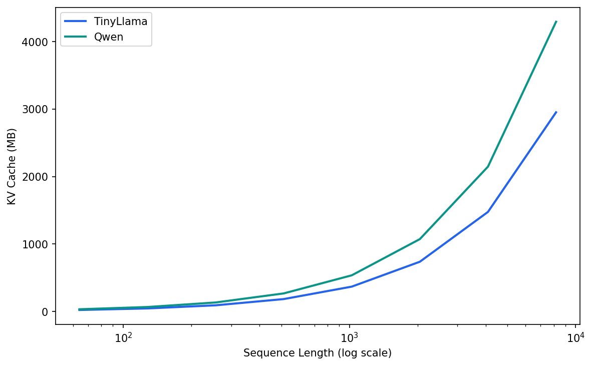

*Figure 1: Synthetic KV cache growth for TinyLlama (22 layers, 4 heads) and Qwen (24 layers, 2 heads, fewer heads compensates for more layers). At 8,192 tokens, TinyLlama requires 144 MB.*

**Analysis.** Despite Qwen having two more layers than TinyLlama, its KV cache is smaller because it uses only 2 KV heads (vs. 4 for TinyLlama). At 8K tokens both models consume over 100 MB for KV cache alone — exceeding the model weights for Qwen2.5-0.5B (≈1 GB in FP16). This underscores why KV cache compression is critical for long-context inference on memory-constrained devices.

---

## 4. Perplexity Baselines (No Compression)

These baselines measure *uncompressed* perplexity as a function of context length for both models and context types.

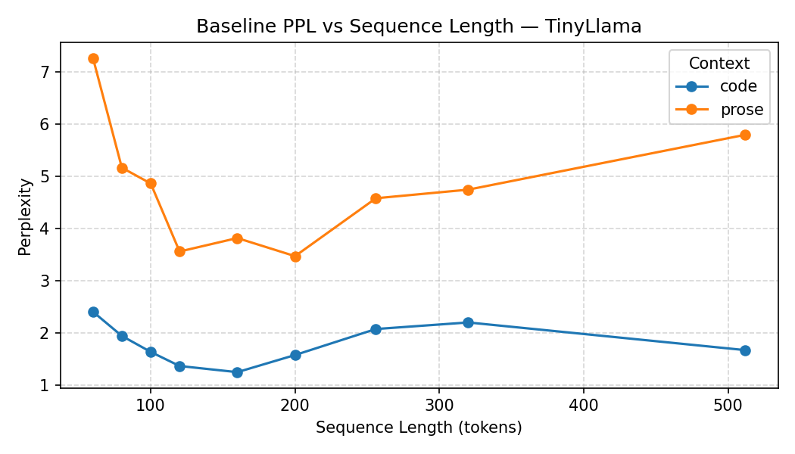	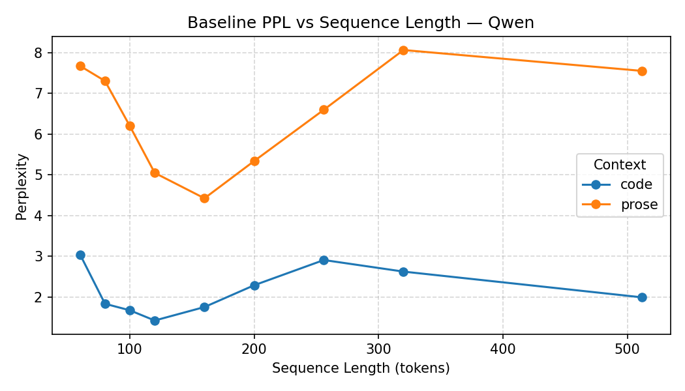
*(a) TinyLlama-1.1B*	*(b) Qwen2.5-0.5B*


*Figure 2: Baseline perplexity (no compression) vs. context length. Code contexts achieve 2–5× lower PPL than prose.*

**Analysis.** Two patterns stand out:

1. **Code is consistently easier.** For both models, code PPL is substantially lower than prose PPL at every context length. The best case is TinyLlama on code at 160 tokens (PPL = 1.25).
2. **PPL does not monotonically improve with context.** Both models show non-monotonic behavior — longer prefix does not always yield better predictions. This is partly because the continuation text is taken from a different portion of the corpus and may be inherently harder.

**Table 1: Best and worst perplexity per model/context (no compression).**

### Best and worst perplexity per model/context (no compression)


| Model | Context | Best PPL | Worst PPL | Range |
| :--- | :--- | :--- | :--- | :--- |
| TinyLlama | code | 1.25 (160 tok) | 2.41 (60 tok) | 1.16× |
| TinyLlama | prose | 3.48 (200 tok) | 7.27 (60 tok) | 2.09× |
| Qwen | code | 1.42 (120 tok) | 3.04 (60 tok) | 2.14× |
| Qwen | prose | 4.42 (160 tok) | 8.06 (320 tok) | 1.82× |


---

## 5. KV Cache Structure Analysis

### 5.1 Layer Depth Profiles

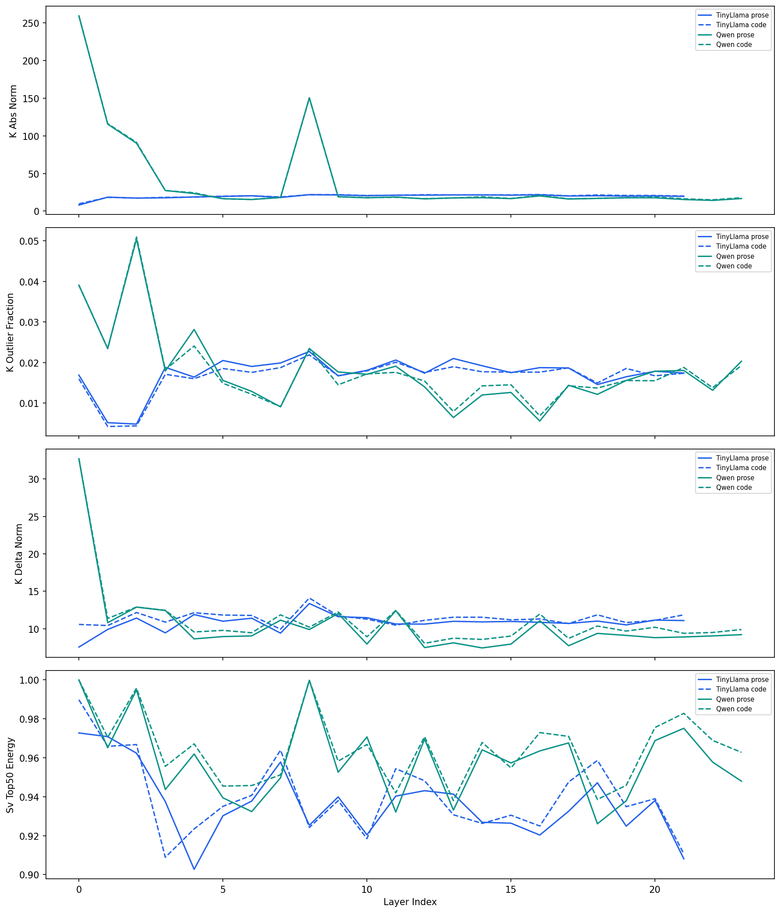

*Figure 3: Four key statistics across layers for all model/context combinations. Solid lines = prose, dashed = code.*

**Analysis.** The depth profiles reveal strong layer-wise heterogeneity that motivates *per-layer* compression policies:

- **KV norm grows with depth** (top-left). Both key and value magnitudes increase through the network, with Qwen showing a dramatic spike at layer 0 and layer 8. Values (dashed) are consistently larger than keys.
- **SVD energy is concentrated everywhere** (top-right). The top-50% energy fraction stays above 0.90 for all layers in all configurations, confirming that low-rank approximation is viable across the entire network.
- **Delta compressibility is key-only** (bottom-left). Key delta compressibility is positive (0.3–0.5 for TinyLlama, 0.34–0.93 for Qwen), but value delta compressibility is *negative* across most layers — temporal differencing *increases* the representation size for values.
- **Outlier fraction is low but non-zero** (bottom-right). Typically 0.5–2.5% of key elements are outliers, with Qwen showing higher outlier rates than TinyLlama.

---

### 5.2 Channel Variance

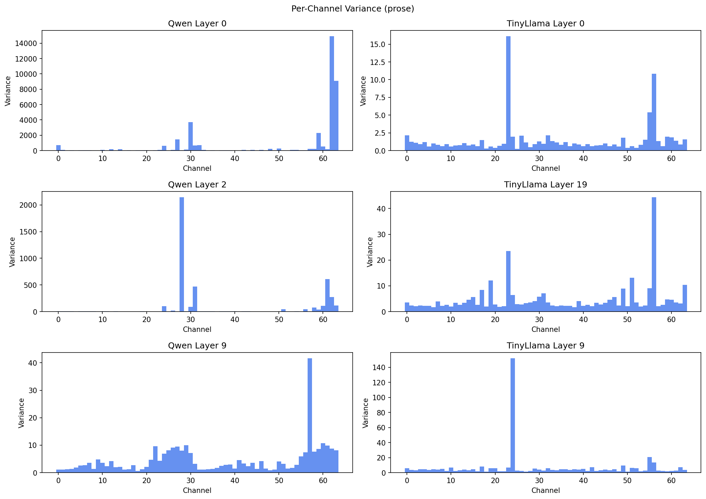	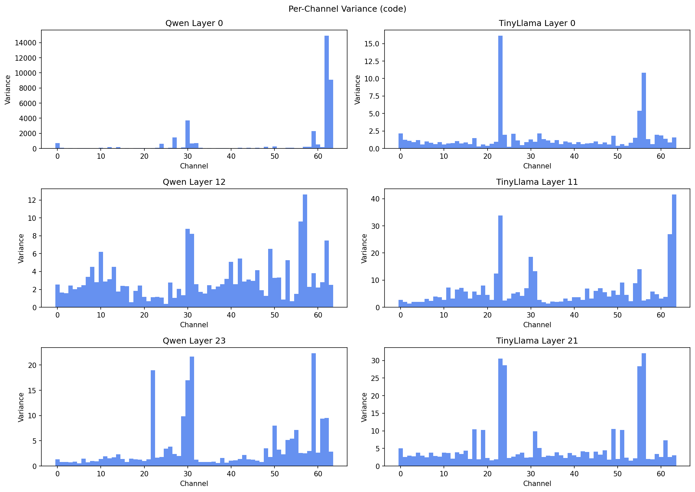
*(a) Prose context*	*(b) Code context*


*Figure 4: Per-channel key variance across layers. Qwen layers 0 and 8 show extreme channel concentration.*

**Analysis.** Channel variance reveals *which* dimensions of the key vectors carry the most information. The critical observation is that variance is *not* uniformly distributed across channels — some head dimensions contribute far more than others.

- For TinyLlama, variance is modestly concentrated with a channel structure ratio of ≈1.5–2.0.
- For Qwen, layers 0 and 8 exhibit extreme channel concentration (ratio >200 at layer 8), meaning nearly all variance is captured by a handful of dimensions.
- This suggests **channel pruning** (dropping low-variance head dimensions) could be highly effective for Qwen's early/middle layers.

---

### 5.3 Token Variance

	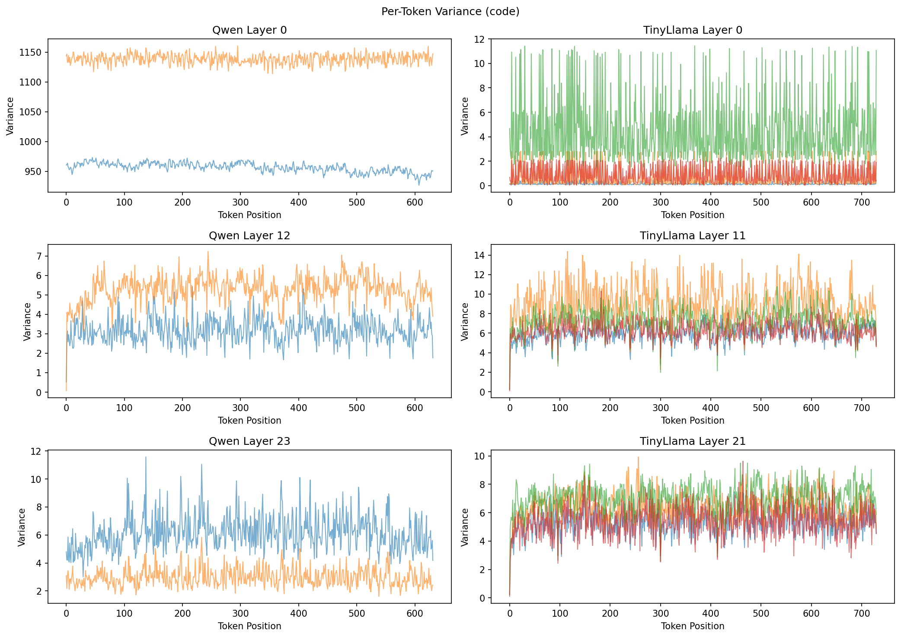
*(a) Prose context*	*(b) Code context*


*Figure 5: Per-token key variance across layers. Variance is highest in middle layers (8–16) for both models.*

**Analysis.** Token variance shows a characteristic inverted-U shape across layers:

- **Early layers (0–3):** low token variance — representations are still generic.
- **Middle layers (8–16):** peak variance — these layers encode the most token-specific information.
- **Late layers (17+):** declining variance as representations converge toward prediction.
- **Implication for compression:** Middle layers may need more conservative compression (higher precision, more tokens retained) than early or late layers.

---

### 5.4 Delta Compressibility

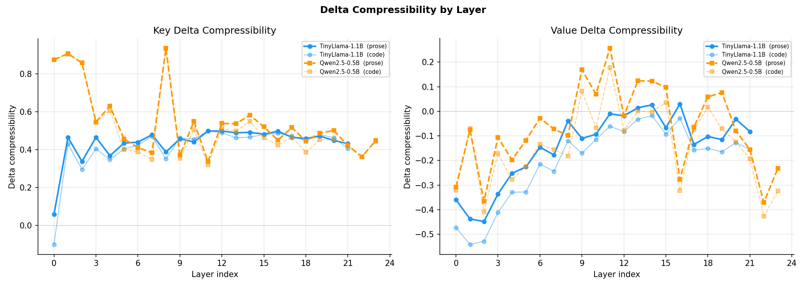

*Figure 6: Delta compressibility for keys (left) and values (right) by layer. Positive values = delta helps; negative = delta hurts.*

**Analysis.** This plot confirms a major finding:

- **KV values are not delta-friendly.** Value delta compressibility is negative for almost all configurations, bottoming at −0.45 for TinyLlama code. Storing value deltas would *increase* the representation cost.
- **Key deltas are moderately effective.** TinyLlama key delta compressibility peaks at ≈0.50 (middle layers), while Qwen reaches ≈0.93 at layers 0 and 8. The extreme compressibility of Qwen's early layers comes from the outlier channel structure noted earlier.
- **Code/prose differences are small** for delta compressibility — the property appears to be model-inherent rather than context-driven.

---

### 5.5 SVD Energy and Effective Rank

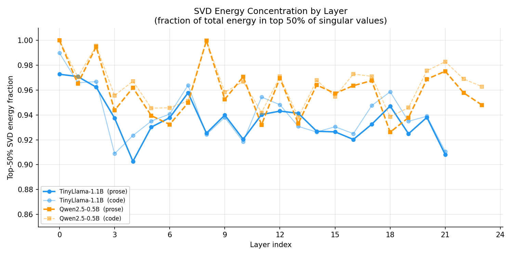	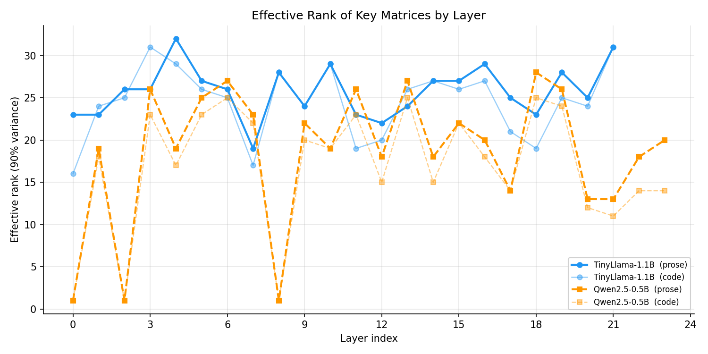
*(a) Top-50% SVD energy fraction*	*(b) Effective rank (90% variance)*


*Figure 7: SVD-based compressibility metrics. Higher top-50 energy and lower effective rank both indicate better low-rank approximability.*

**Analysis.**

- **Nearly all layers are low-rank.** The top-50% energy fraction exceeds 0.90 for every layer in every configuration, meaning at most 32 (of 64) singular components carry >90% of the energy.
- **Qwen layer 0 is rank-1.** The effective rank of Qwen's first layer is 1 for prose and code — the key matrix is essentially a rank-1 outer product. This is an unusually strong signal for extreme compression of this specific layer.
- **Prose is more low-rank than code.** Across both models, prose contexts consistently show higher SVD energy concentration and lower effective ranks than code contexts. Structured natural language yields more compressible key matrices.
- **Effective rank varies 3–32 across layers**, suggesting that a *uniform* low-rank budget (e.g., keeping 16 components everywhere) would over-allocate for some layers and under-allocate for others.

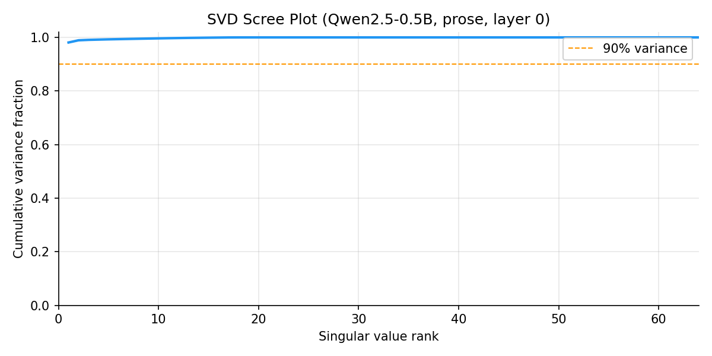

*Figure 8: SVD cumulative variance for Qwen layer 0 (prose). The dashed line marks 90% variance — achieved with only a handful of components.*

---

### 5.6 Channel Structure and Outliers

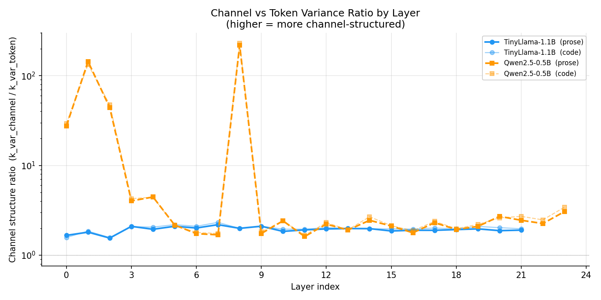	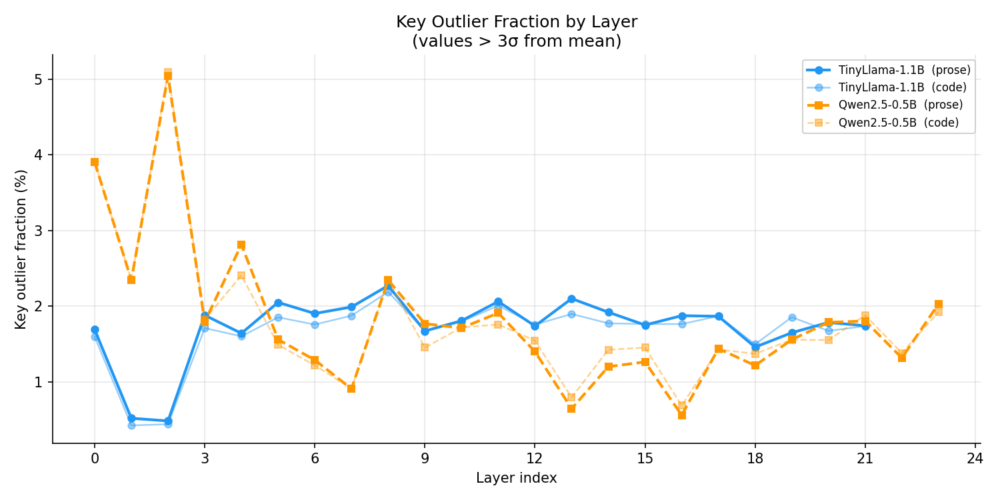
*(a) Channel-vs-token variance ratio (log scale)*	*(b) Key outlier fraction (%)*


*Figure 9: Structural properties of key matrices across layers.*

**Analysis.**

- **Channel structure ratio** reveals that most layers are slightly channel-structured (ratio > 1, variance is more across channels than tokens). However, Qwen layers 0 and 8 are extreme outliers with ratios exceeding 200 — the variance is almost entirely channel-wise.
- **Outlier fraction** is generally low (<2.5%), but Qwen consistently shows higher outlier rates than TinyLlama. This has implications for quantization: more outliers mean larger quantization error for uniform quantizers, suggesting non-uniform or outlier-aware schemes may be necessary for Qwen.
- **Middle layers show more outliers** for Qwen, peaking at ≈5% in the prose context. Combined with higher variance in middle layers, this reinforces that middle layers are the most challenging to compress.

---

### 5.7 Autocorrelation

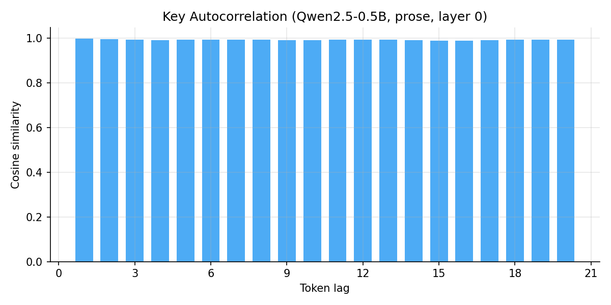

*Figure 10: Cosine similarity of key vectors at increasing token lags (Qwen layer 0, prose). Decay is slow, indicating long-range token similarity.*

**Analysis.** The autocorrelation at increasing token lags shows that key vectors maintain cosine similarity of 0.7–0.8 even at lag 20, indicating substantial temporal redundancy. This slow decay supports token-eviction strategies: if tokens 20 steps apart are still 70% similar, older tokens can be safely dropped or merged with minimal information loss.

---

## 6. Llama.cpp KV Quantization Baselines

These baselines were collected using `llama-perplexity` and `llama-bench` on a Qwen2.5-0.5B model (BF16 weights) with three KV cache formats: FP16, Q8_0 (8-bit quantization symmetric), and Q4_0 (4-bit quantization symmetric).

### 6.1 Perplexity Impact

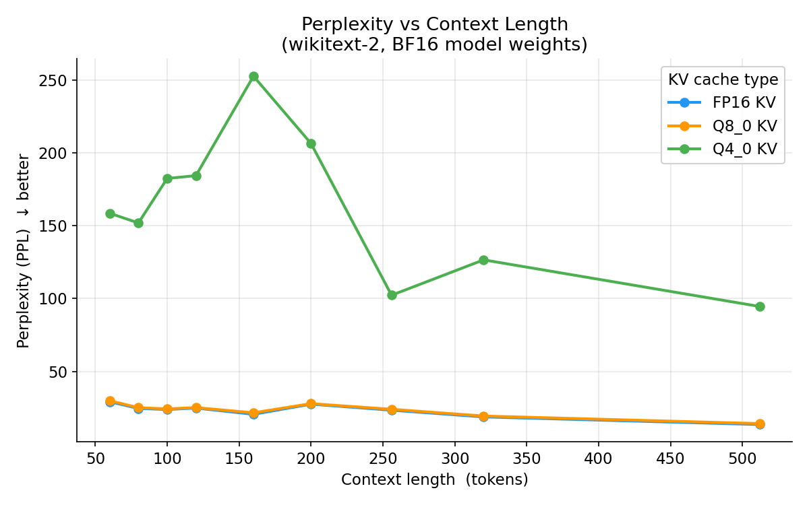

*Figure 11: Perplexity vs. context length for FP16, Q8_0, and Q4_0 KV cache quantization (Qwen2.5-0.5B, wikitext-2).*

**Analysis.**

- **Q8_0 is near-lossless.** Across all context lengths, Q8_0 perplexity tracks FP16 almost exactly. At 512 tokens: FP16 = 15.08, Q8_0 = 15.17.
- **Q4_0 degrades noticeably.** PPL increases by a considerable margin vs. FP16. At 512 tokens: Q4_0 = 94.53, a +598% increase. At 160 tokens the gap is widest.
- **The gap is context-length-dependent.** Q4_0 degradation is largest at 160 - 200 tokens, possibly because the quantization error interacts non-linearly with the attention pattern at those lengths.

### Table 2: Average PPL across all context lengths per KV type.


| KV Type | Mean PPL | vs. FP16 | Compression |
| :--- | :--- | :--- | :--- |
| **f16** | 22.9209 | 1.00× | 1.00× |
| **q8_0** | 23.4876 | 1.02× | 2.00× |
| **q4_0** | 162.1735 | 7.08× | 4.00× |


### 6.2 Decode Latency

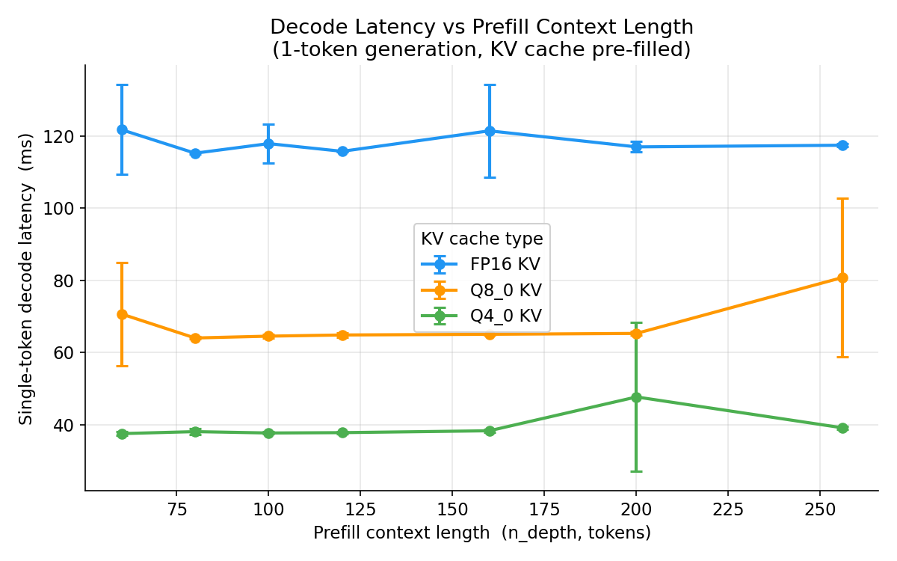

*Figure 12: Single-token decode latency vs. prefill context length for FP16, Q8_0, and Q4_0 KV caches (Qwen2.5-0.5B, Intel i7-7820X).*

**Analysis.**

- **KV quantization brings substantial speedups.** Q8_0 decode is ≈1.8× faster than FP16; Q4_0 is ≈3.0× faster.
- **Latency is largely flat with context length** for all three KV types on this hardware — the attention computation is not the bottleneck at these short context lengths (60–256).
- **The latency benefit comes from memory bandwidth.** Smaller KV cache entries reduce DRAM traffic during the attention score computation, which dominates on CPU inference.

### Table 3: Average decode latency per KV type.


| KV Type | Mean Latency (ms) | Speedup | Bytes/Element |
| :--- | :--- | :--- | :--- |
| **FP16** | 115.9 | 1.00× | 2 |
| **Q8_0** | 64.6 | 1.79× | 1 |
| **Q4_0** | 38.2 | 3.03× | 0.5 |


**Trade-off summary.** Q8_0 offers a "free lunch" — near-zero PPL cost with a 1.8× latency improvement. Q4_0 trades 27% higher PPL for 3× speedup. The sweet spot for most applications is likely Q8_0.

---

## 7. Conclusions

### 7.1 Which Compression Axes Are Most Promising?

Based on the evidence collected, compression approaches are ranked by expected effectiveness:

1. **8-bit quantization (Q8_0 / FP8). Strongest signal.** The llama.cpp baseline proves Q8_0 is near-lossless (<0.6% PPL increase) with 1.8× throughput improvement. The FP8 implementation (`fp8_press.py`) enables this directly in PyTorch with the Native fp8 dtype. Caveat with using this native format is that we cannot do additions or matmuls with the quantized format.

2. **Low-rank / SVD-based compression. Strong signal.** SVD energy is highly concentrated (90–100% in top 50% of components) across all layers. Effective ranks of 3–32 suggest 2–20× theoretical compression is possible with per-layer adaptive rank budgets. Qwen layer 0 (effective rank 1) is an extreme case.

3. **Per-layer adaptive policies. Strong signal.** Every metric (variance, effective rank, delta compressibility, outlier fraction) shows significant layer-wise heterogeneity. Uniform compression budgets will leave performance on the table. An oracle that assigns different compression strength per layer would substantially outperform any uniform scheme.

4. **Channel pruning for Qwen. Moderate signal.** Qwen layers 0 and 8 exhibit extreme channel concentration (ratio >200). Dropping low-variance head dimensions could yield significant compression with minimal quality loss. This is less promising for TinyLlama where channel structure is weaker.

5. **Token eviction. Moderate signal.** Slow autocorrelation decay (0.7+ similarity at lag 20) supports dropping or merging older tokens. Combined with the token variance profile (peaks in middle layers), eviction strategies should be more aggressive in early and late layers.

6. **Delta encoding. Weak signal for values, moderate for keys.** Key deltas show 30–93% compressibility, but *value* deltas are *anti-compressible* (negative compressibility). Delta encoding should only be applied to keys, and even then, benefits vary dramatically by layer and model.

7. **4-bit quantization. Weak signal for quality.** llama.cpp Q4_0 degrades PPL by ~600% at its peak, which is unacceptable for most applications. However, if aggressive compression is needed, combining Q4_0 with error compensation or calibration-aware quantization could close some of this gap.

---

### 7.2 Next Steps

1. **Benchmark FP8 (e4m3) KV compression** using the `FP8Press` class against the llama.cpp Q8_0 and FP16 baselines. Measure both PPL and decode latency.
2. **Implement per-layer adaptive low-rank compression an dother literatiure.** Use the effective rank data (Table 4) to set per-layer rank budgets, then measure PPL vs. overall compression ratio. We should also explore lossless one step compression techniques like KeepKV and leverate the new "post-vision spare attention" technique in VLCache(ICLR 2025) for VLMs.
3. **Explore hybrid compression.** Combine FP8 quantization (precision axis) with low-rank approximation (dimension axis) and/or token eviction (sequence axis). The data suggests these axes are largely orthogonal and can be composed.
4. **Add longer-context experiments for LLMs and VLMs.** Current data is limited to ≤730 tokens. For production scenarios (4K–128K tokens), the relative importance of KV compression grows quadratically with sequence length.


---

*All plots, data, and source code are available in the `KVCompressionExperiments` repository.